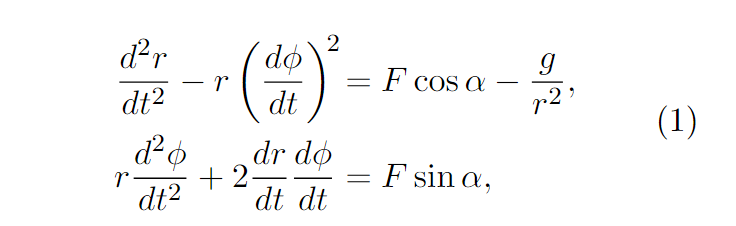

# Numeriska Metoder Projekt

## Instruktioner
#### Raketen
Trots att raketmotorn går för fullt förblir rymdskeppet hängande orörlig på höjden H över
jordytan. Kaptenen låter rymdskeppet vrida sig nittio grader från det tidigare radiellt riktade
läget, och i fortsättningen verkar raketmotorn horisontellt (vinkelrätt mot ortsvektorn) med
oförminskad kraft. Störtar rymdskeppet eller klarar det sig ut i rymden?

Med lämpliga enheter — längdenhet jordradie
och tidsenhet timme — lyder Newtons rörelseek-
vationer uttryckta i polära koordinater:

Kursen avslutas med ett projekt som består av en lite större uppgift där flera olika numeriska metoder behöver användas och kopplas ihop för att få fram en lösning. Arbetet med projektet kommer ni att göra i period 4. Projektet görs med fördel i tvåmannagrupper. 
#### SCHEMALAGD TID
Information om projektet får ni på föreläsningen den 22 mars. Arbetet med projektet görs i huvudsak utanför schemalagd tid men tre dubbeltimmar i datorsal finns avsatt för frågor och handledning:  31/3, 14/4 och 29/4. Se schemat för detaljer.
#### ANMÄLAN TILL PROJEKTUPPGIFT
Anmälan till projektuppgiften är obligatoriskt. Ni anmäler er genom att gå med i en av de Canvas-grupper som skapats för projekten.  Det finns 25 grupper för varje projektuppgift och grupperna har samma namn som projektuppgiften. Anmälan stänger den 29 mars. 
#### **REDOVISNING**
Projektet redovisas med en skriftlig kortare teknisk rapport och Matlab-program.  Kompletterande muntlig redovisning kan ibland krävas. 
**Deadline är 2 maj.** Inlämningen gör ni elektroniskt under "Uppgifter" i vänstermenyn. Både rapport och Matlab-kod ska skickas in. Som tillägg till rapporten ska ni även skicka in en checklista där ni har checkat av att projektet är utfört enligt instruktioner och att allt finns med i rapporten. Detta för att undvika onödiga kompletteringar. 
Rapporterna rättas efter 2 maj och är färdigrättade till den 12 maj.  Om man inte blir godkänd då kommer det finnas viss möjlighet till komplettering. **Deadline för kompletteringen är den 20 maj. Det är en skarp deadline.** 

#### **PROJEKTLYDELSER OCH CHECKLISTA**
Rapporten ska fokusera på de de specifika frågorna i uppgifterna. Den kan vara kortfattad, och behöver inte innehålla någon bakgrundsdel om själva problemet. Rapporten är normalt 1-2 sidor lång, exklusive bilder. Längden är dock inte det viktiga. Det som räknas är att all den efterfrågade informationen finns med, presenterad på ett korrekt och lättfattligt sätt.

#### För varje deluppgift ska ni i rapporten:

- Besvara specifika frågeställningar tydligt. Inkludera efterfrågade figurer. Var noga med att inte missa någon fråga!
- Ange vilka algoritmer ni använt och förklara hur ni tillämpar dem på det aktuella problemet.  (Skriv alltså inte bara *“vi löser problemet med sekantmetoden”* utan **“vi använder sekantmetoden för att lösa ekvationen f(x)=0 där f ges av… och startgissningar ges av...“**.) Speciellt:
    - För ODE-metoder ska det vara tydligt vilket (första ordningens) system y’=f(t,y) som metoderna tillämpas på. Vad (precis) är elementen i vektorn y och vad (precis) är den vektorvärda funktionen f? Glöm inte att även specificera begynnelsedata.
    - För randvärdesproblem ska ni visa hur **matrisen och högerledet i finita differensmetoden ser ut, och hur ni kom fram till detta.**
    - För Newton ska ni **ange funktionen och Jacobi-matrisen, F och J,**  för det aktuella fallet.
- Förklara kortfattat hur ni hittar nedslagspunkter, maxpunkter, periodlängder med hjälp av interpolation, etc.
- Inkludera eventuella härledningar för teorifrågor (Varför E(t) är konstant i Kretsen? )
- När ni kopplar ihop flera numeriska metoder för att lösa problemet ska ni ge en översikt över de olika stegen i er algoritm och hur de hänger ihop.
- Kort kommentera resultaten: Är de rimliga/motsägelsefulla? Väntade/oväntade? Ointuitiva/självklara? Stämmer de med teorin?

#### Notera också:

- För alla numeriska svar (siffersvar) ska ni göra en **numerisk tillförlitlighetsbedömning**, dvs uppskatta och ange de numeriska felen, tillsammans med en kort motivering till er slutsats. (Se avsnittet Instruktioner och tips i Projektlydelserna för hur man gör detta.) Var konkret och kvantifiera. Är felet 0.01? Är det 0.0001? Varför? (Ge inte bara vaga antydningar om att felet är litet, med motiveringar som att “konvergensen är kvadratisk” eller “metoden har hög noggrannhetsordning”. Svara inte med 16 decimaler utan kommentar.) 
- För att uppskatta osäkerhet i modellen kan ni använda **experimentell störningsanalys.** Förklara kort i rapporten hur ni gjort detta och hur ni räknat fram de efterfrågade osäkerheterna. (Se avsnittet Instruktioner och tips i Projektlydelserna.)

#### Egen arbetsinsats
Sist i rapporten ska ange er egen arbetsinsats i ett separat avsnitt: Vad har ni skrivit själva? Vilka har ni fått hjälp av, med vad? Det är tillåtet att diskutera ideer och algoritmer med andra grupper, men ni ska ha gjort hela projektet självständigt. Speciellt ska ni ha skrivit all Matlab-kod själva och formulerat projektrapporten på egen hand. **Ingen kod får kopieras.** Om ni är medvetna om att er Matlab-kod/rapport liknar andra gruppers måste ni kommentera det här, och ge en bra förklaring. Kursen tillämpar reglerna i hederskodexen

## Rapportens form
- Rapporten ska vara i PDF-format
- På framsidan ska följande information finns med:
- Projektuppgiftens namn
- Gruppens namn
- Gruppmedlemmarnas namn, personnummer och email-adress (för båda om ni arbetat i en grupp av två)
- Infoga figurer/tabeller löpande i dokumentet (ej som appendix).
- Figurer och tabeller behöver vara förståeliga. Lägg in benämningar på axlar och förklara vad som plottas i bildtitel/bildtexter osv., i den grad som det behövs.
- Inkludera gärna relevant Matlab-kod i ett appendix så att vi snabbt kan titta på koden. (All kod ska också skickas in i Canvas tillsammans med rapporten.)

#### Matlab-kod
Skriv läsbara Matlab-program: 
- Strukturera koden
- Undvik "cut and paste"-lösningar och globala variabler
- Använd vettiga variabelnamn
- Kommentera kluriga delar eller satser
Det går bra att skicka in flera Matlab-filer. **Men inte ihoppackade i en arkiv-fil.** Filerna bör innehålla ett huvudprogram kallat tex **main.m** som anropar övriga programfiler och skriver ut tydliga svar på alla frågor (om siffervärden) och genererar alla plottar (annoterade med titel etc.) som efterfrågas i uppgiftstexterna. 

Det är ok att göra koden så att vissa parametrar behöver ändras manuellt för att få fram resultaten. Då måste dock detta förklaras tydligt i en kommentar i koden, där man kan utläsa vilka parametervärden ni har använt för olika uppgifter.

***Notera:*** Alla filer ska skickas in, men ni får gärna inkludera dem i ett appendix i rapporten också. (Det underlättar för oss vid rättningen.)

## Notes

## Checklista

#### För att undvika onödiga kompletteringar och som en extra kontroll att projektet är utfört enligt
#### instruktionerna samt att innehållet i rapporten är komplett, gå igenom och checka av punkterna
#### nedan innan ni skickar in rapport och kod.
#### **Ifylld checklista skickas in tillsammans med rapporten.**

- []  Vi har läst informationen om projektet i Canvas samt det inledande kapitlet Instruktioner och
        tips i projektlydelsen.
- []  Vi har gjort alla uppgifter och svarat på alla frågor i vårt projekt. Svaren finns redovisade i
        rapporten.
- []  Vi har använt effektiva numeriska metoder enligt sektionen Instruktioner och tips i projektly-
        delsen.
- []  Vi har angett i rapporten vilka metoder/algoritmer vi använder och har förklarat hur vi tilläm-
        par dessa på vårt problem.
- []  Vi har inkluderat eventuellt efterfrågade härledningar för teorifrågor i rapporten.
- []  Vi har beskrivit hur vi kommer fram till våra resultat som presenteras i rapporten.
- []  Vi har gjort en rimlighetsuppskattning av våra resultat.
- []  Vi har gjort (och presenterar) en tillförlitlighetsbedöming av alla numeriska resultat som pre-
        senteras i rapporten.
- []  Vi presenterar resultaten i rapporten med ett rimligt antal siffor.
- []  Vi har kommenterat och dragit slutsatser av resultaten som presenteras i rapporten.
- []  Vi har lagt in alla efterfrågade figurer/plottar i rapporten.
        Plottarna har text på axlarna och en figurtext som förklarar vad plotten visar.
- []  Vi har beskrivit vår egen arbetsinsats och informerat om eventuella samarbeten i rapporten.